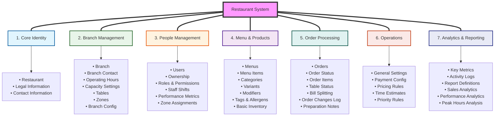

```mermaid
flowchart TD
    Restaurant["Restaurant System"]

    Restaurant === CoreIdentity["1. Core Identity"]
    Restaurant === BranchManagement["2. Branch Management"]
    Restaurant === PeopleManagement["3. People Management"]
    Restaurant === MenuManagement["4. Menu & Products"]
    Restaurant === OrderManagement["5. Order Processing"]
    Restaurant === OperationalSettings["6. Operations"]
    Restaurant === Analytics["7. Analytics & Reporting"]

    CoreIdentity --> CoreSub["• Restaurant
    • Legal Information
    • Contact Information"]

    BranchManagement --> BranchSub["• Branch
    • Branch Contact
    • Operating Hours
    • Capacity Settings
    • Tables
    • Zones
    • Branch Config"]

    PeopleManagement --> PeopleSub["• Users
    • Ownership
    • Roles & Permissions
    • Staff Shifts
    • Performance Metrics
    • Zone Assignments"]

    MenuManagement --> MenuSub["• Menus
    • Menu Items
    • Categories
    • Variants
    • Modifiers
    • Tags & Allergens
    • Basic Inventory"]

    OrderManagement --> OrderSub["• Orders
    • Order Status
    • Order Items
    • Table Status
    • Bill Splitting
    • Order Changes Log
    • Preparation Notes"]

    OperationalSettings --> OpsSub["• General Settings
    • Payment Config
    • Pricing Rules
    • Time Estimates
    • Priority Rules"]

    Analytics --> AnalyticsSub["• Key Metrics
    • Activity Logs
    • Report Definitions
    • Sales Analytics
    • Performance Analytics
    • Peak Hours Analysis"]

    style Restaurant fill:#f9f,stroke:#333,stroke-width:4px
    style CoreIdentity fill:#e1f5fe,stroke:#01579b,stroke-width:2px
    style BranchManagement fill:#e8f5e9,stroke:#1b5e20,stroke-width:2px
    style PeopleManagement fill:#fff3e0,stroke:#e65100,stroke-width:2px
    style MenuManagement fill:#f3e5f5,stroke:#4a148c,stroke-width:2px
    style OrderManagement fill:#e0f2f1,stroke:#004d40,stroke-width:2px
    style OperationalSettings fill:#fbe9e7,stroke:#bf360c,stroke-width:2px
    style Analytics fill:#e8eaf6,stroke:#1a237e,stroke-width:2px
```
